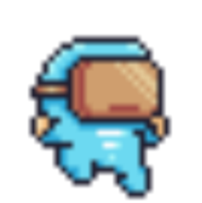
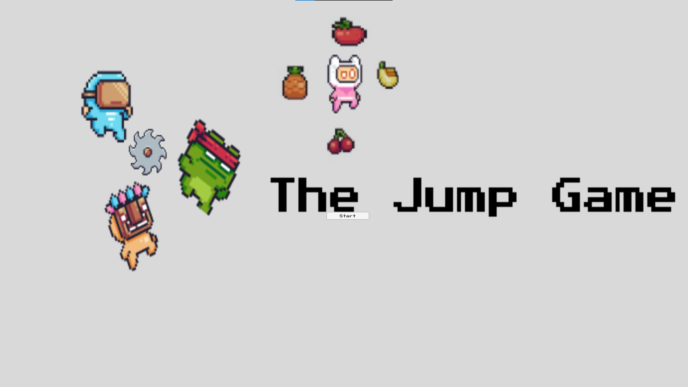
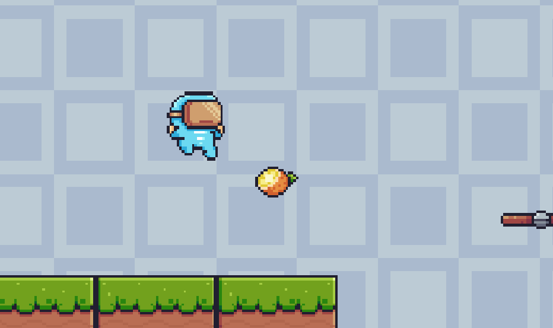
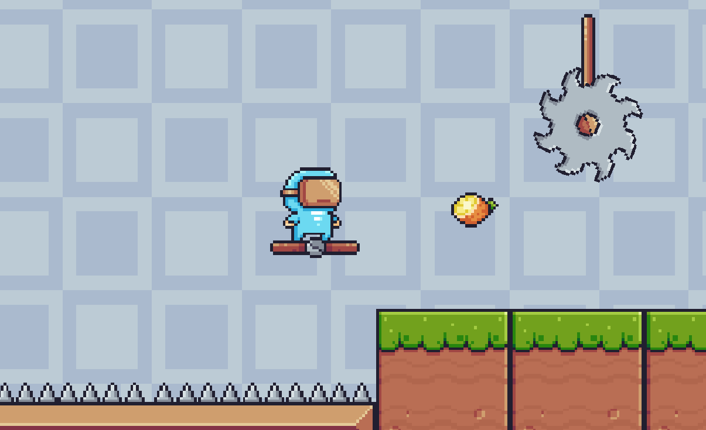
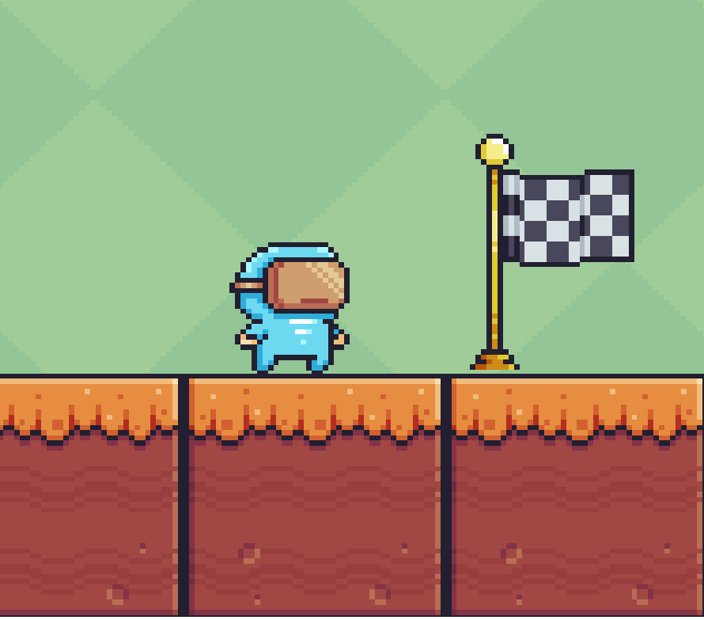

# Jump Game

- Hello everyone, this is my first game
- It is made using Unity Game engine
- Currently it only supports Windows 64 bit
- Hope you enjoy it

---

## Downloading the game

- Click on the green coloured "Code" button
- Select "Download ZIP"
- Extract the ZIP file
- Inside the Build folder, click on Jump Game.exe file to play the game
- Your feedback is highly appreciated

---

## Game Controls

> character controls

- `right-arrow ->` key to move to the right
- `left-arrow <-` key to move to the left
- `spacebar` key to jump

- optionally you can also use keys `A` and `D` for *left* and *right* movements respectively.

> upgrades

- collect **cherries**, number of **cherries** are your *points*
- collect the oranges to increase life, **1 orange = 1 life**

---

## Game Aim

> You are a cute character stranded in a level. Your only mission is to escape the rotating blades and clear the level. You can collect cherries which are placed in between. You are initially granted 5 lives to finish the 2 levels. Try to reach the finish flag with maximum number of cherries collected.

#### character look :- 

---

## Screenshots
### start menu

---
### In Game
- grab the orange to increase lives

---
- avoid thorns and rotating blades

---
- reach the flag to finish the level and advance to the next

---

## Contribution

- The game is under development, any contribution to the game will be helpful.